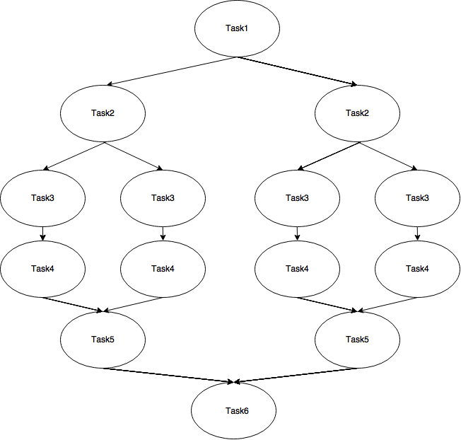
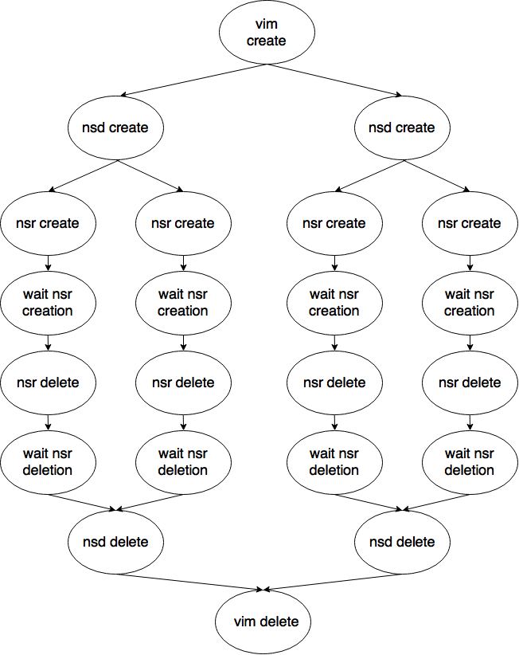

# How to use the Integration Tests

## Overview

This project provides integration tests. 
Three tests are run.

1. scenario-dummy-iperf
2. scenario-many-dependencies
3. scenario-real-iperf

scenario-dummy-iperf uses the Dummy VNFM to simulate a VNFM and therefore tests the communication between NFVO and VNFM. 
It does not actually deploy a network service. The fake network service is a simple iperf scenario with one server and one client. 

scenario-many-dependencies also uses the Dummy VNFM but its fake network service is a little bit more complex in the sense that it has many VNFD with many dependencies between them. 

The last test scenario-real-iperf is the only one which actually deploys a network service on openstack. 
It consists of two VNFD and deploys one iperf server and two iperf clients. The clients contact the server. 

In every test a vim instance and a network service descriptor is stored on the orchestrator and the network service launched. 
If that is successful, the network service is stoped and the network service record, network service descriptor and the vim instance are removed. 
In the case of the scenario-real-iperf test also the service itself is tested, i.e. if iperf is running and the clients can connect to the server. 

## Requirements

1. A running NFVO
2. A running Generic VNFM
3. A running Dummy VNFM

## Installation and configuration

Clone the project to your machine. 
In *integration-tests/src/main/resources* is a file named integration-test.properties. 
Open it and set the property values according to your needs. 

| Field          				| Value       																|
| -------------   				| -------------:																|
| nfvo-ip  					| The ip of the machine on which the NFVO you want to use is running |
| nfvo-port					| The port on which the NFVO is running |
| nfvo-usr					| The username if a login is required for the NFVO |
| nfvo-pwd                                      | The password if a login is required for the NFVO |
| local-ip					| The ip of the machine on which the integration test is running |

After that you will also need a keypair for openstack. Create one and download the private key as a .pem file. 
Rename it to integration-test.pem and provide it with the needed permissions by executing *chmod 400 integration-test.pem*.
Create the directory */etc/openbaton/integration-test* on your machine and move the pem file into it. 
The next step is to create a vim file. 
Here is an example where you just have to change some fields. 
```json
{
  "name":"vim-instance",
  "authUrl":"http://your-openstack-url",
  "tenant":"the tenant you use",
  "username":"openstack username",
  "password":"openstack password",
  "keyPair":"in here the one you created",
  "securityGroups": [
    "default"
  ],
  "type":"openstack",
  "location":{
    "name":"your location",
    "latitude":"the latitude",
    "longitude":"the longitude"
  }
}
```

Name the vim file *real-vim.json* and add it to the folder *integration-tests/src/main/resources/etc/json_file/vim_instances/* in the project.
In the folder *integration-tests/src/main/resources/etc/json_file/network_service_descriptors* of the project you will find a file named NetworkServiceDescriptor-iperf-real.json. 
Open it and replace the floating ip values at lines 42, 107 and 114 with floating ips which are provided to you by openstack. 
If you want to you can also change the virtual link which is at the moment "private" to one you want to use. 
Then use a shell to navigate into the project's root directory. 
Execute the command *./gradlew clean build*.
After that you will find the folder *build/libs/* in the project. Inside of this folder is the project's executable jar file. 

## Start the integration test

Before starting the integration test be sure that the NFVO, Generic VNFM and Dummy VNFM you want to use are already running. 
Then start the test by navigating into the folder *integration-tests/build/libs* and execute the command *java -jar integration-tests-0.15-SNAPSHOT.jar*.

## Test results

While the tests are running they will produce output to the console. This output will be logged in the file integration-test.log which is in the project's root directory. 
If a test finished it will either tell you that it passed successfully or not. 
If it did not pass correctly you will find the reason in the log file. 

### Description
The Integration Test project can be used to test a tree or a graph of consecutive tasks. Each task may obtain/return an object before/after the execution.
To implement a new task, you need to extend the SubTask abstract class and implement the method doWork() with your logic.
In the doWork() method you can get the result of the father's execution as an object by the method getParam(). Since the SubTask
class implements Callable<Object> you can return an object at the end of the method doWork().
You can describe the tree/graph of the tasks through the ini file.

### Simple example

We have four tasks to execute in the following order:



We will create the classes:
- Task1
- Task2
- Task3
- Task4
- Task5
- Task6

All of them extend SubTask and implement the method doWork(). The costructor of each classes accept only Properties.
Example of Task2:
```java
public class Task2 extends SubTask{

public Task2(Properties properties){
  //..
}

@Override
protected Object doWork() throws Exception {
  //Get parameter from Task1
  Object param = getParam();

  //.. do work ..

  // return an object that Task3 will get with getParam()...
  return anObject;
}
}
```

Then we create the following ini file:
```
[it]
;set the maximum time (in seconds) of the Integration test. e.g. 10 min = 600 seconds
max-integration-test-time = 600
;set the maximum number of concurrent successors (max number of active child threads)
max-concurrent-successors = 10

[it/task1-1]
class-name = Task1
successor-remover = task6-1

[it/task1-1/task6-1]
class-name = Task6

[it/task1-1/task2-1]
class-name = Task2
num_instances = 2
successor-remover = task5-1

[it/task1-1/task2-1/task5-1]
class-name = Task5

[it/task1-1/task2-1/task3-1]
class-name = Task3
num_instances = 2
specific-parameter = 14.3

[it/task1-1/task2-1/task3-1/task4-1]
class-name = Task4
```

In the main you can use the class IntegrationTestManager to start the scenario:
```java
// File f = loadFileIni("file.ini");
// Properties properties = loadProperties();

IntegrationTestManager itm = new IntegrationTestManager("basepath of the tasks") {
	@Override
	protected void configureSubTask(SubTask subTask, Profile.Section currentSection) {
			if(subTask instanceof Task3){
			  Task3 t3 = (Task3) subTask;
			  // set a parameter specificated in the ini file in the section [it/task1-1/task2-1/task3-1]
			  // If "specific-parameter" is not present in the ini file, "5" will be the default
			  t3.setSpecificParameter(Double.parseDouble(currentSection.get("specific-parameter", "5")));
			}
	}};
boolean result = itm.runTestScenario(properties, file);
```

### Integration Test for Openbaton

### Prerequisites

* The related project [OpenBatonNFVO](https://gitlab.fokus.fraunhofer.de/neutrino-dev/nfvo) must be installed, please see [the README](https://gitlab.fokus.fraunhofer.de/neutrino-dev/nfvo/blob/master/README.md) file

Also if you run the integration tests, make sure that the NFVO and VNFM you want to use are already running. 
You have to modify the file /opt/openbaton/integration-tests/src/main/resources/integration-test.properties to your 
specific needs. You have to indicate parameters for the NFVO you want to test, the IP of the machine the 
integration test is running on and information about the used database. 

### Description

The Integration Test project is used to test the correctness of the operations carried out by NFVO and VNFM.
The main operations to be tested are the creation and deletion of entities and the actual network service.
The entities are:
* network service description (nsd)
* network service record (nsr)
* vim instance (vim)

To create a realistic scenario the above operations must follow an order. Example:
- vim create
  - nsd create (one or more)
    - nsr create (one or more)
    - waiting for the end of creation/s
    - nsr delete (all)
    - waiting for the end of deletion/s
  - nsd delete (all)
- vim delete

Alternatively you can also deploy the nsd from previously stored VNFPackages:
- vim create
  - vnf-package upload
    - nsd create (one or more)
      - nsr create (one or more)
      - waiting for the end of creation/s
      - nsr delete (all)
      - waiting for the end of deletion/s
    - nsd delete (all)
  - vnf-package delete
- vim delete

As you can see the flow of operations is a graph that begins with the vim creation and ends with the vim deletion.
To create your own test, you must specify the flow of operations in the configuration file (.ini).


In the ini file you can specify your own flow of operations as a graph. These ini files have to be in the directory /src/main/resources/integration-test-scenarios.
Example of ini file:
```
[it]
;set the maximum time (in seconds) of the Integration test. e.g. 10 min = 600 seconds
max-integration-test-time = 600
;set the maximum number of concurrent successors (max number of active child threads)
max-concurrent-successors = 10

;vimInstance-create
[it/vim-c-1]
class-name = VimInstanceCreate
name-file = vim-instance.json

;nsd-create
[it/vim-c-1/nsd-c-1]
class-name = NetworkServiceDescriptorCreate
num_instances = 2
successor-remover = nsd-d-1
name-file = NetworkServiceDescriptor.json

;nsd-delete
[it/vim-c-1/nsd-c-1/nsd-d-1]
class-name = NetworkServiceDescriptorDelete

;nsr-create
[it/vim-c-1/nsd-c-1/nsr-c-1]
class-name = NetworkServiceRecordCreate
num_instances = 2

;nsr-wait
[it/vim-c-1/nsd-c-1/nsr-c-1/nsr-w-1]
class-name = NetworkServiceRecordWait
;the default timeout is 5 seconds
timeout = 500
action = INSTANTIATE_FINISH

;nsr-delete
[it/vim-c-1/nsd-c-1/nsr-c-1/nsr-w-1/nsr-d-1]
class-name = NetworkServiceRecordDelete

;nsr-wait
[it/vim-c-1/nsd-c-1/nsr-c-1/nsr-w-1/nsr-d-1/nsr-w-1]
class-name = NetworkServiceRecordWait
;the default timeout is 5 seconds
timeout = 500
action = RELEASE_RESOURCES_FINISH
```
You will obtain the following flow of operations:



First the vim instance is created. by [it/vim-c-1]. You have to provide the name of the json file to use. It should be stored in 
/etc/openbaton/integration-test/vim-instances/ on your local machine or in /resources/etc/json_file/vim_instances/ in the integration test project. 
The files in the former directory have a higher priority than the ones in the latter directory. 
After that the integration test creates a network service descriptor in the task [it/vim-c-1/nsd-c-1]. 
And not just that, it even creates two because the num_instances field is set to two. 
The json file for the NSDs have to be in the directory /etc/openbaton/integration-test/network-service-descriptors/ or in 
/resources/etc/json_file/network_service_descriptors. 
As you can see this task has also a 'successor-remover'. 
The task which is specified there, will be executed after all the other branches which emerge from [it/vim-c-1/nsd-c-1] 
are finished. In this case it is the deletion of the NSD. 
In the following tasks every created NSD will deploy two network service records in [it/vim-c-1/nsd-c-1/nsr-c-1]. 
Then the task [it/vim-c-1/nsd-c-1/nsr-c-1/nsr-w-1] waits for the occurrence of the event INSTANTIATE_FINISH which comes after 
the successful deployment of the NSRs. Afterward the NSRs are deleted by [it/vim-c-1/nsd-c-1/nsr-c-1/nsr-w-1/nsr-d-1] and 
another waiter is defined to wait for the deletion. 
The last step of this example is the deletion of the NSD [it/vim-c-1/nsd-c-1/nsd-d-1]. As mentioned before, this is the successor-remover 
of the NSD creation task. It is not possible to define a task in a branch after a successor remover. 
Furthermore it is also possible to execute two tasks simultaneously. Therefore just define tasks in the following way: 
One is [it/task1/task2] and the second is [it/task1/task3]. This would execute task2 and task3 at the same time. 

The tasks that create entities from json files (i.e. VimInstanceCreate, NetworkServiceDescriptorCreate) use a parser. The static
parser class Parser is described below.

### Using VNFPackages
Here is an example on how to use VNFPackages in your tests. 

```
[it]
;set the maximum time (in seconds) of the Integration test. e.g. 10 min = 600 seconds
max-integration-test-time = 800
;set the maximum number of concurrent successors (max number of active child threads)
max-concurrent-successors = 10

;vimInstance-create
[it/vim-c-1]
class-name = VimInstanceCreate
name-file = vim.json
successor-remover = vim-d-1

[it/vim-c-1/vim-d-1]
class-name = VimInstanceDelete

;package-create
[it/vim-c-1/vnfp-c-1]
class-name = PackageUpload
package-name = iperf-server-package.tar

;nsd-create
[it/vim-c-1/vnfp-c-1/nsd-c-1]
class-name = NetworkServiceDescriptorCreateFromPackage
name-file = NetworkServiceDescriptor.json

;nsd-delete
[it/vim-c-1/vnfp-c-1/nsd-c-1/nsd-d-1]
class-name = NetworkServiceDescriptorDelete

;package-delete
[it/vim-c-1/vnfp-c-1/nsd-c-1/nsd-d-1/vnfp-d-1]
class-name = PackageDelete
package-name = iperf-server-package
```

This example begins by storing a vim instance. Then the package iperf-server-package.tar is stored. 
The packages have to be in the directory /etc/openbaton/integration-test/vnf-packages/ or in 
/resources/etc/vnf_packages. The former has a higher priority than the latter. 
Afterwards a NSD is created from the VNFDs in the package and right after that deleted. Be aware that you 
have to use the class NetworkServiceDescriptorCreateFromPackage to store a NSD from a package. 
Then also the package will be deleted. You have to provide the name of the package you want to delete. 
At the end the vim instance is deleted. 

If you create a NSD from a VNFPackage, the VNFD field of the NSD file would look something like this: 

```
"vnfd":[
{
      "id":""
},
{
      "id":""
}

   ],
```

The integration test will automatically insert some IDs of VNFDs that were previously stored by a VNFPackage. 


### Parser
The class Parser looks for a configuration file with this syntax:

old_value = new_value

In the json file, passed to the method Parser.randomize(), all the old_value will be replace with new_value.
IMPORTANT: in the json file, the old_value must have the following sintax:

"some_parameter" = "<::old_value::>"

If we want to put random values:

old_value = new_value***

In the json file, passed to the method Parser.randomize(), all the old_value will be replace
with new_value plus 3 random characters (e.g. new_valuezxd).

### Simple parser example
Parser config file (parser.config):
```
admin=admin***
```
Json file:
```
{
"username":"<::admin::>"
}
```
Use of Parser class:
```java
String newJson = Parser.randomize(oldJson, "parser.config");
```
The string newJson will be:
```
{
"username":"adminxkz"
}
```

### Testing the service itself

Now we will show how to test, if the network service is actually running.
Therefore you can tell the integration test to ssh the instantiated virtual machines and execute commands.
Those commands have to be written in scripts which can be placed in two locations.
Either in **/etc/openbaton/integration-test/scripts/** or in **/integration-tests/src/main/resources/etc/scripts/** in the
project itself. The former directory is checked first for a script name. If it does not exist there the latter location is used.
But where do I specify the Virtual Machines on which the scripts shall be executed?? Well, also in the .ini file.
Use the *GenericServiceTester*.

Let's take look at an example. You specified in your .ini file a scenario with an iperf-server and an iperf-client.
Iperf is a tool to measure the throughput of a network. So in our setup the iperf-server will listen on the default iperf port for the
iperf-client to send him some testing data.
To check if iperf is running on the two virtual machines, we will create two new tasks in the .ini file.
The first one is:
```

[it/vim-c-1/nsd-c-1/nsr-c-1/nsr-w-1/gst-1]
class-name = GenericServiceTester
vnf-type = server
script-1 = iperf-running.sh
```

The class name specifies, that we want to use the GenericServiceTester to test our service.
The vnf-type is used to say on which virtual network functions the scripts should be executed and is equal to the one you wrote into the network service descriptor.
In our example the integration test would execute them on a virtual machine, which runs the iperfserver VNF which has the type 'server'.
And finally you have to specify the script name. script-1 will be the first script executed in that task.
If you want to execute more than that, just add script-2, script-3 and so on.
The same thing is done for the iperfclient:
```

[it/vim-c-1/nsd-c-1/nsr-c-1/nsr-w-1/gst-2]
class-name = GenericServiceTester
vnf-type = client
script-1 = iperf-running.sh
```

Here is the script used to see if iperf is running:
```

#!/bin/bash

iperf_count=`exec ps -aux | grep -v grep | grep iperf | wc -l`
if [ $iperf_count -lt 1 ]
then
  exit 1
else
  exit 0
fi

```

As you can see the script exits with status 0 on success and otherwise on 1 like usual. Every script you write for the integration test should
exit on a value not 0 if they fail. The integration test will just pass if all the scripts exit on 0.

So, now we know that iperf is running on the server and on the client virtual machine. But are the client and server really communicating at the moment?
To test that we will add another script to the client and server task, that checks if there is an outgoing or incoming connection related to iperf and exits successfully 
if one exists. Here's the script:
```

#!/bin/bash

# this will return the ip of the remote partner of the communication, here the iperf-server
outgoing=`sudo netstat -npt | grep iperf | awk '{print $5}' | sed 's/:.*//'` 

# check if the communication partner is really the iperf-server
if [ $outgoing == ${server_ip} ]
then
  exit 0
else
  exit 1
fi
```

(You may wonder where '${server_ip}' comes from. It is a variable provided by the integration test as explained later. 
We use sudo for the netstat command, because the iperf command was started by the root user.)

We add it to the clients task in the .ini file:
```

[it/vim-c-1/nsd-c-1/nsr-c-1/nsr-w-1/gst-1]
class-name = GenericServiceTester
vnf-type = client
script-1 = iperf-running.sh
script-2 = iperf-clt-connection.sh
```

To the servers task we add following script:
```

#!/bin/bash


incoming=`sudo netstat -npt | grep iperf | wc -l`

if [ $incoming -eq 0 ] 
then
  exit 1
else
  exit 0
fi
```

Here we just count if there are incoming connections to the server. 

```

[it/vim-c-1/nsd-c-1/nsr-c-1/nsr-w-1/gst-2]
class-name = GenericServiceTester
vnf-type = server
script-1 = iperf-running.sh
script-2 = iperf-srv-connection.sh
```

After the iperf-running.sh script, the iperf-srv-connection.sh script will be executed on the server virtual machines 
and on the client one's the script iperf-clt-conection.sh.

And that's it for the .ini file. After those tasks you can add the usual delete nsr/nsd etc. tasks or even more GenericServiceTester tasks.


Now imagine, that you did not specify one virtual network function component in the client's nsd, but five. And you want to test them all.
Do you have to create five tasks for that?? No, if you define the task for the client as shown above, the integration test will execute
the scripts on every virtual machine, that was deployed by the vnfd with the type *client*.

And if you have some virtual network function components connected to two different networks but just want to test the ones connected
to one of them, you can add a *net-name* field to the task and just the ones connected to it will be involved.
Example:
```

[it/vim-c-1/nsd-c-1/nsr-c-1/nsr-w-1/gst-2]
class-name = GenericServiceTester
vnf-type = client
net-name = private
script-1 = iperf-running.sh
script-2 = iperf-clt-connection.sh
```

Now we come back to the '${server_ip}' variable in the iperf-clt-connection script. As mentioned earlier this variable is provided 
by the integration test. It stores the ip of the server. If you wanted to access the IPs of the clients, you could use ${client_ip}. 
The problem is, that we could for example also have two or more instances of clients. Which ip is chosen? 
Actually the script, which contains this variable will be executed twice or more on the virtual machine until every possible substitution was handled. 
You have access to the IPs, floating IPs and configurations. 
You can access ips by writing ${vnfrtype_ip} or ${vnfrtype_network_ip} (don't forget the braces). The 'vnfrtype' in our example would be 'server' or 'client'. 
The 'network' is the virtual_link you specified in the VNFD for the VNF Component and will only retrieve the VNFC ips which are connected to this network. 
If you have more than one VNFC Instance which is deployed, so for example you have two iperf-servers 
deployed from one VNFD, then there would be two possibilities to substitute ${server_ip}. If you want to execute a script on the virtual machine of the 
iperf-client which contains this variable the integration test will do the following. Execute the script containing the 
variable with first the ip of one server. And then executing the same script, but now replacing the variable with the other ip. 
That way you just have to write one script and all the VNF Components of the VNF will be tested. 
You can access the floating ips of VNFCs by writing ${vnfrtype_fip} or ${vnfrtype_network_fip}. 
Of course, this will only work if there is a floating ip for that virtual machine. 
The configurations are accessible by typing ${vnfrtype_configurationkey}. 
For all the variables it is essential, that you enclose them with braces otherwise they won't work. 


IMPORTANT Information to use the GenericServiceTester:

For the integration test to be able to ssh to the virtual machines on openstack, you have to provide a .pem file of a key-pair you are using on openstack.
Download this file, name it *integration-test.pem* and put it into the directory **/etc/openbaton/integration-test/**.
Furthermore it has to have the correct permissions so you probably have to execute *chmod 400 integration-test.pem*.
And don't forget to make the scripts executable.
Do not use '-' in types of VNFDs or configuration names as you cannot use them in bash scripts it will not work for the integration test scripts. 


### Development

* Want to contribute? Great!

### News and Website

* Information about OpenBaton can be found on our website. Follow us on Twitter @openbaton.

### License